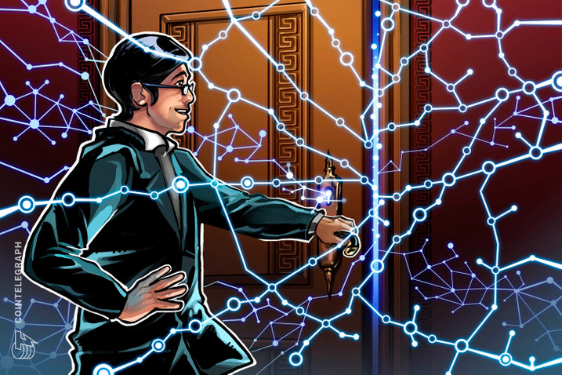

韩国科学和信息通信技术部 (MSIT) 透露了放弃对元界实施传统视频游戏法的计划。相反，该部决定发布新的指导方针，以激励新兴生态系统的发展。

韩国对获得 Web3 和 Metaverse 生态系统的兴趣从它为创建内部 Metaverse 进行的2 亿美元投资中得到证明。与这项工作并行，MSIT 发现实施旧法规会阻碍新生态系统的发展。

在国家数据政策委员会的第一次会议上，MSIT 指出，“我们不会犯用现行法律规范新服务的错误。” 然而，关于将 Metaverse 指定为视频游戏的讨论仍在讨论中。

该部决定，包括元界、自动驾驶和 OTT 流媒体平台在内的新行业需要制定新的法规。关于元界，MSIT 提出了由于缺乏法律和制度基础而阻碍工业增长的担忧。透露该计划，新闻稿的粗略翻译如下：

> “制定游戏产品和虚拟世界分类指南，以实现合理和一致的监管并支持相关法律的制定（制定特殊的虚拟世界法律等）”

此前，9 月 1 日，国会议员支持制定《元界产业促进法》以支持 Web3 产业的官方提案。

**相关内容：韩国对 Terra 创始人 Do Kwon 发出逮捕令**

在支持新技术发展的同时，韩国当局继续打击运行 Terra 生态系统的人。

韩国检方称，Terraform Labs 的联合创始人兼首席执行官 Do Kwon 涉嫌通过发行 LUNA 和 USTC 来欺骗投资者，而没有通知投资者两者价格可能一起暴跌的危险。

因此，检察官已向当局申请吊销 Kwon 和其他 Terra 员工的护照。