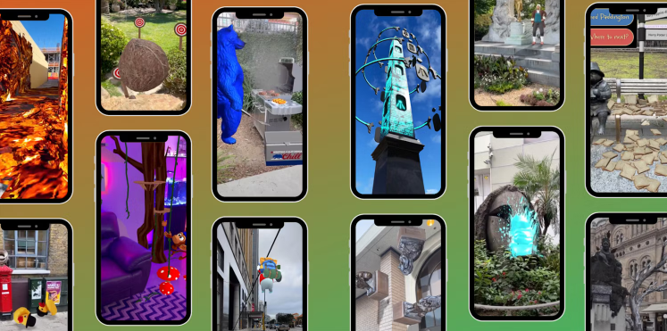

Niantic在网络浏览器上引入了对其增强现实世界映射技术的支持。许多公司一直在引入新的 AR 和虚拟现实技术，以创造更多方式让虚拟世界更加身临其境。当创作者可以使用其他功能时，AR 和 VR 体验就会出现新的可能性。

AR 和 VR 的进步依赖于创建体验所需的软件和用于跟踪和参与交互的硬件。甚至可能不需要手持或头戴式设备来查看现实世界中的虚拟对象。一些大公司，如迪士尼，正在开发可用于主题公园游乐设施和其他现实世界环境的不戴眼镜的 AR。