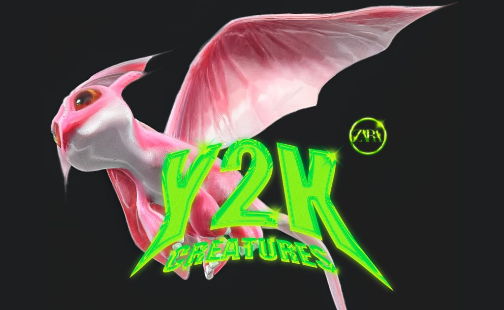

该系列包括一件背心、三件毛衣、一件心形上衣、一件无肩带连衣裙、一条带羽毛的绿松石喇叭裤和两条裙子，以及一系列配饰，包括一个包、项链、一对耳环和一双靴子.

Metaverse 平台 Zepeto 上还提供数字配件，例如墙纸、照相亭、不同的发型和四种指甲样式。

Y2K Creatures 是 Zara 的第三个元宇宙系列，继去年 12 月推出的 Ader Error 和 3 月推出的第二个名为 Lime Glam 的系列之后。

从 9 月 22 日起，bew 系列在 Zara.com、选定的 Zara 商店和 Zepeto 的应用程序上开始在全球发售。

