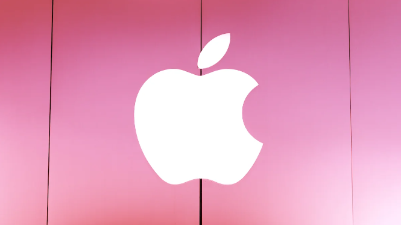
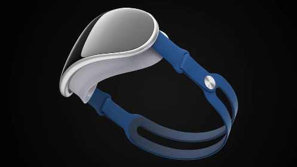
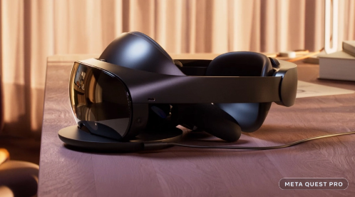

科技巨头在元宇宙]中看到了巨大的机会——这个名称赋予了未来、更身临其境的互联网愿景，并具有潜在的现实世界联系。正如其品牌重塑所暗示的那样， Facebook 的母公司 Meta对这一前景下了很大的赌注，而微软则与 Meta 合作并收购了一家主要的游戏发行商，因为它在该领域建立了势头。

苹果呢？

这家 iPhone 和 Mac 制造商以独特的硬件和软件设计方法而闻名，甚至将“不同思维”的理念融入其营销中。随着虚拟世界通过新的硬件和在线世界形成——其中一些将使用 NFT 等可互操作的 Web3 技术构建[——Apple](https://decrypt.co/resources/non-fungible-tokens-nfts-explained-guide-learn-blockchain)可能会再次走自己的路。

报告显示，苹果将通过一款昂贵的耳机开始进入虚拟世界，以弥合虚拟环境和数字增强现实世界使用之间的差距。Apple 能否像过去的许多小玩意一样，将 Metaverse 纳入主流？这是我们目前所知道的。

**什么是苹果建筑？**

多年来，科技媒体一直在追踪苹果的增强现实 (AR) 雄心，据报道该公司自 2015 年以来一直在朝着这个方向发展。最新的报道表明，苹果将从提供虚拟现实 ( VR) 和 AR 功能，并有望在未来进一步发布其他 AR 专用硬件。

彭博社报道称，苹果的第一款耳机预计将在 2023 年的某个时候推出，根据被认为与苹果相关的商标申请，它可能被称为 Reality One 或 Reality Pro。预计它将是一款售价超过 3,000 美元的高端设备——尽管苹果分析师 Ming-Chi Kuo 已将价格定在 2,000 至 2,500 美元之间。

由艺术家 Ian Zelbo 创作的概念渲染图。图片：伊恩泽尔博

在任何一种情况下，这都将比Meta 的新 Quest Pro混合现实头戴设备显着增加，后者售价为 1,500 美元。尽管如此，Meta 的头戴设备还是让我们一窥混合现实头戴设备所能提供的体验类型，该头戴设备可以将数字内容叠加在用户的全彩色真实世界视图之上——以及该技术可能实现的更逼真的交互。

一方面，它是一款满载的 VR 耳机，可以访问在线社交平台（如 Meta 自己的 Horizon Worlds）并玩沉浸式游戏。另一方面，混合现实功能可用于与数字屏幕和模型进行交互，同时仍能看到现实世界，或者与物理合作者一起使用数字工具创作艺术和音乐。

元任务专业版。图片：元

据报道，Apple 的第一款耳机将使用该公司 Mac 中强大的 M2 处理器，并配备更广泛的摄像头和传感器——包括能够准确重现用户腿部运动的摄像头和传感器，Meta仍在研究中。信息报告称，视网膜扫描仪将为登录、付款等提供生物识别安全性。

报告中提到的其他潜在功能包括显示佩戴者面部表情的外部屏幕——可能会消耗电池寿命——以及供眼镜佩戴者使用的定制、卡扣式处方镜片。但是，Apple 目前尚未确认任何内容，并且一些报告的功能可能不会成为第一台设备（甚至是后来的设备）。

**元宇宙呢？**

Metaverse 将不仅限于 VR 和 AR 耳机。已经有早期的 Web3虚拟世界游戏和应用程序存在于计算机和移动设备上，随着更多虚拟世界平台的出现并相互重叠，这种情况可能会继续存在，从而大规模地创建一个更具沉浸感、体验性的互联网。

但混合现实耳机被认为是迈向未来的关键踏脚石，许多人认为这将是体验元宇宙世界的最佳方式。毕竟，这样的耳机可以增强沉浸感，更自然地捕捉佩戴者的细微差别和互动，同时保持与现实世界的联系——这可能是两种场景中最好的。

然而，如果没有令人信服的软件，这样的硬件就毫无用处，而苹果公司很清楚两者需要顺利结合。*据彭博社报道*，苹果正在开发 RealityOS 操作系统，以及地图和 FaceTime 等体验版应用程序，以及消费媒体和游戏以及与其他佩戴者协作的途径。

Apple 对混合现实体验和沉浸式在线交互的愿景是否与其他开发者的努力相匹配还有待观察，但 Apple 很可能不会接受流行的“元界”一词本身。苹果总是使用自己独特的品牌——此外，首席执行官蒂姆库克说他不喜欢这个词。

“我一直认为让人们了解事物是什么很重要，”库克在 9 月告诉荷兰媒体Bright，“而且我真的不确定普通人能告诉你什么是元宇宙。”

但库克看好增强现实和混合现实技术，以及那里的潜在用例，他告诉该出版物，“我认为 AR 是一项影响一切的深刻技术。想象一下突然能够使用 AR 进行教学并以这种方式展示事物。或者医学上的等等。就像我说的，我们真的要回首往事，想想我们曾经在没有 AR 的情况下是如何生活的。”

**Web3 和互操作性怎么样？**

Web3 爱好者希望看到一个基于开源区块链技术、使用NFT表示数字资产所有权、分布在可互操作平台上的元宇宙，用户可以在这些平台之间跳转并仍然使用他们的所有数字资产。

鉴于此，人们担心中心化的科技巨头试图加强并引导未来互联网的方向朝着他们可以控制的方向发展。然而，有趣的是，Meta 首席执行官马克扎克伯格表示，他相信“开放、可互操作”的元宇宙“对每个人都更好”，并表示 Meta 将与广泛的其他建设者一起工作。

虽然这不是对 Web3 技术的明确拥抱，也不是承认 Meta 将构建一个真正开放的元节平台，但它的语气比许多人过去对公司的期望更为宽容。苹果会效仿并以类似的心态构建自己的元宇宙应用程序和体验吗？

历史表明并非如此。苹果可以说是“围墙花园”封闭生态系统的最大供应商，其锁定的 iOS 平台和 App Store 模式从开发者的应用程序和内容销售中抽取了相当大的份额。

这激怒了 Fortnite 制造商 Epic Games 等竞争对手，该公司正在与苹果和谷歌进行法律斗争，以期开放其应用生态系统。2021 年 11 月，Epic Games 首席执行蒂姆·斯威尼 (Tim Sweeney) 表示“没有公司可以拥有”元宇宙，而 Epic 本身正在该领域做出重大举措，同时也没有使用 Web3 技术本身。

最近的证据还表明，Apple 并不热衷于让 Web3 技术破坏其利润丰厚的商业模式。Apple 允许 App Store 开发人员通过他们的 iOS 应用程序销售 NFT，但仍会从所有销售额中抽取 30% 的分成——比任何领先的 NFT 市场都要高出数倍。这对许多当前的 Web3 分发模型提出了相当大的挑战。

但苹果不一定是反加密货币的。许多著名的加密货币交易所和钱包制造商都有 iOS 应用程序，让用户可以通过 iPhone 使用他们的加密货币。库克过去曾表示，苹果正在“关注”加密货币，并表示他拥有加密货币并“有一段时间”感兴趣。苹果还列出了需要加密货币经验的职位空缺。

所有这一切都意味着苹果拥抱一个以 Web3 为中心的开放元宇宙的前景十分模糊 。苹果很可能会选择以自己的方式构建元宇宙，与行业的其他公司不同，但随着 Web3 采用的增长和开放平台的重要性上升，这种模式是否会在未来继续结出硕果尚不清楚。

至少，扎克伯格确信苹果正在为虚拟世界做出自己的贡献。根据The Verge看到的记录，在 2022 年 7 月回答员工提问时，Meta 首席执行官表示，它和苹果公司正在“就互联网应该走向何方进行一场非常深刻的哲学竞争”。

