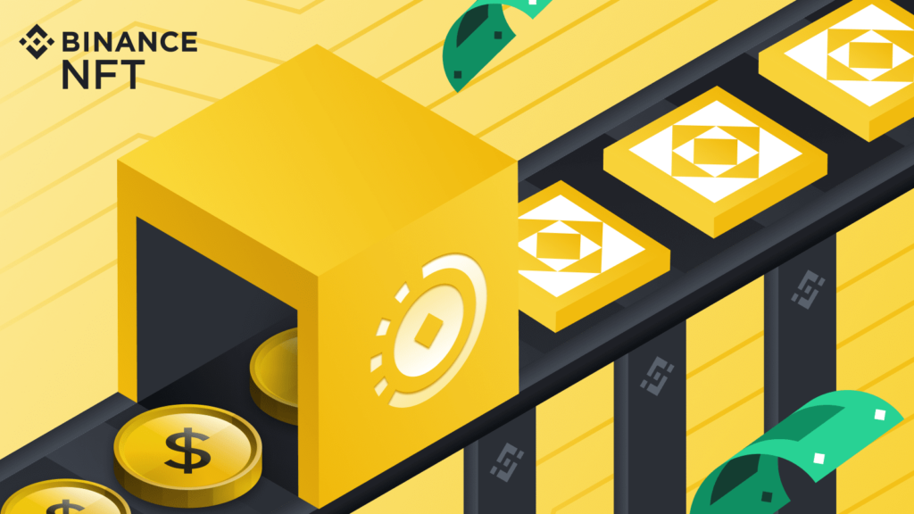

在许多方面，艺术是人类经验的终极表达。通过大师们的技巧，以多种形式捕捉和表达美，绘画是最常见的。然而，由于古典和历史艺术是以实物形式完成的，这件作品会随着时间的推移而退化，更糟糕的是会因损坏和磨损而丢失。 

正在努力保护历史艺术品；然而，这些方法需要时间和技巧，而且成本很高。专业设备、多轮分析和数小时的工作都倾注于保存这些心爱的作品。但是，如果有一种更具创新性和实用性的方法可以让它们几乎永远保持不变呢？ 

输入不可替代的代币或 NFT。NFT 是记录在区块链上的独特数字资产。这些数字资产通常以艺术品的形式呈现。NFT 提供了许多实用程序，其中之一是通过使用智能合约和唯一代码来验证资产的真实性和所有权。NFT 艺术不仅限于绘画或数字图像，还延伸到其他形式的媒体，例如 3D 艺术、音乐和视频。

使用数字技术来展示和保存艺术品并不是一个新概念。Ars Electronic 和 Seeing Double 等项目就是以新形式呈现艺术作品的著名例子。开放保护基金会和美国国家数字信息基础设施和保护计划也在努力创建不仅具有文化遗产而且具有知识意义的数字档案。数字复制也是捕捉大师作品之美的常用方式。通过现代设备，保护主义者不仅可以捕捉和复制颜色的准确性，还可以捕捉和复制艺术品的更精细的细节和细微差别。

通过融合区块链技术，通过数字化手段保存艺术品可以更进一步。NFT 的一个核心功能是验证真实性，这意味着一旦保存的艺术品在区块链上铸造，它就不会失去其真实性，并且可以很容易地检测到复制和复制艺术品的企图。由于区块链的公开分类账，艺术在其数字形式中也变得更容易在全球范围内访问，因为只需单击一个按钮即可轻松找到它。人们不必飞到博物馆排队等候，就能一睹胡安·卢纳的*Spoliarium*或费尔南多·阿莫索洛的*Antipolo。*

这也是一个关键，可访问性。

随着 NFT 技术，尤其是数字艺术 NFT 的兴起，许多现代大师开始探索这种媒介。由于他们不再需要依赖画廊，因此选择艺术家作品的自由度更大。 

授予视觉艺术家的特纳奖得主 Mark Wallinger 等艺术家最近涉足 NFT。早在 1990 年代，达明安·赫斯特 (Damien Hirst) 就在英国艺术界声名鹊起。 

菲律宾自己的 Love Marie Ongpauco-Escudero，俗称 Heart Evangelista，也在 2021 年发布了 Pluviam 和 Desiderantium，这是一种以 NFT 为媒介的艺术。 

Heart 的项目是与菲律宾 NFT 艺术家、Cryptopop 艺术协会创始人 Luis Buenaventura 和马尼拉爱乐乐团的 Rodel Colmenar 合作完成的。 

Cryptopop Art Guild 还致力于为使用 NFT 作为媒介的弱势菲律宾艺术家提供机会。 

这些现代艺术家的作品都可以在线观看，没有传统画廊的限制和不可避免的恶化挑战。

数字市场还有助于让爱好者更容易获得数字 NFT 艺术。OpenSea 和 Binance NFT Marketplace 等 NFT 市场已成为全球数千件艺术品的所在地，每件艺术品都提供各种形式的效用和价值。

创新技术可以帮助带来使艺术品不朽的新方法。NFT 是这项创新的一部分，不仅值得将其视为进一步保存经典作品的一种手段，而且还可以作为现代大师表达自己的新媒介。